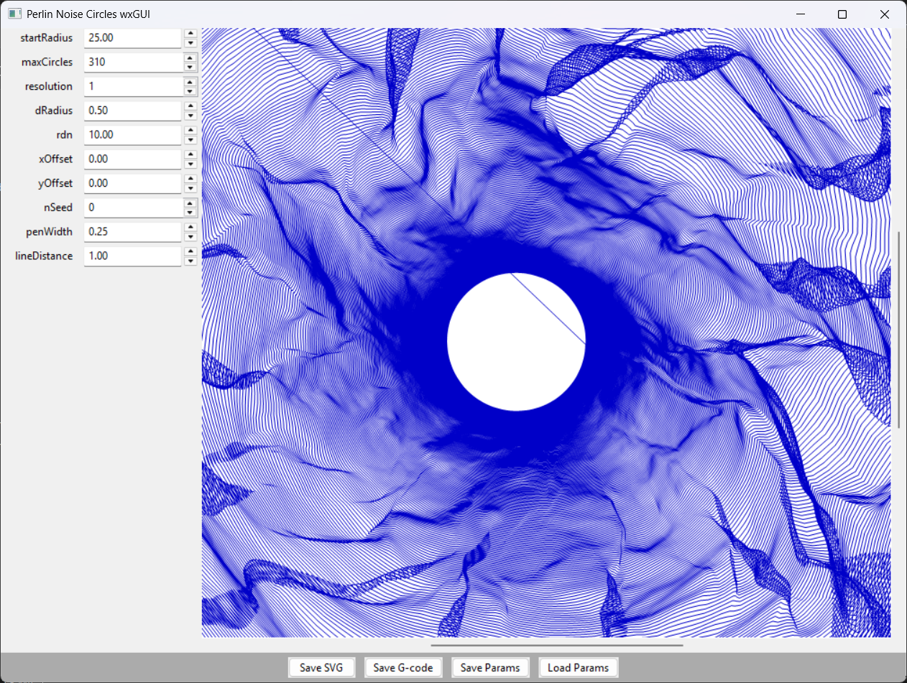

# PerlinNoiseCircle_wxCPP
*Create hypnotic, ever-expanding circle art from Perlin noise — C++ desktop application with wxWidgets.*

### This is a C++ port of the Python wxPython version, faithfully recreating the same functionality with native performance.

---

## ✨ What it does

PerlinNoiseCircle_wxCPP generates mesmerizing, organic ring patterns using 2-D Perlin noise. Each ring is mathematically placed to create unique, flowing patterns that look hand-drawn yet are completely deterministic.

- **Real-time parameter control** – sliders update the drawing instantly
- **Export to SVG** – vector-perfect for posters, stickers, or laser-cutting  
- **Export to G-code** – drop the generated `.nc` file straight onto CNC mills or plotters
- **Save / load presets** – keep your favourite styles as JSON snippets
- **Cross-platform** – native C++ with wxWidgets; runs on Windows, macOS, Linux
- **High performance** – native C++ implementation with custom Perlin noise

---

## 📸 Screenshot



*The application interface showing the parameter controls on the left and the generated Perlin noise circle pattern on the right.*

---

## 🚀 Building

### Prerequisites
- CMake 3.16 or later
- C++17 compatible compiler (Visual Studio 2019+, GCC 8+, Clang 8+)
- wxWidgets 3.1.0 or later
- nlohmann/json (for JSON parameter handling)

### Windows (Visual Studio)
```bash
# Install dependencies via vcpkg (recommended)
vcpkg install wxwidgets nlohmann-json

# Configure and build
cmake -S . -B build-win -DCMAKE_TOOLCHAIN_FILE=[vcpkg root]/scripts/buildsystems/vcpkg.cmake
cmake --build build-win --config Release
```

### Linux
```bash
# Install dependencies
sudo apt-get install libwxgtk3.0-gtk3-dev nlohmann-json3-dev

# Build
mkdir build && cd build
cmake ..
make -j$(nproc)
```

### macOS
```bash
# Install dependencies via Homebrew
brew install wxwidgets nlohmann-json

# Build
mkdir build && cd build
cmake ..
make -j$(sysctl -n hw.ncpu)
```

---

## 🎛️ Controls

| Parameter        | Effect |
|------------------|--------|
| startRadius      | radius of the very first circle |
| maxCircles       | how many rings to draw |
| resolution       | degrees between line segments (1 = 1°) |
| dRadius          | growth step per segment |
| rdn              | randomness damping (higher = smoother) |
| x / y Offset     | translate the entire drawing |
| nSeed            | noise seed (0 → random) |
| penWidth         | stroke thickness in SVG / G-code |
| lineDistance     | distance multiplier between rings |

---

## 📁 Files

- `src/main.cpp` – application entry point
- `src/MainFrame.cpp` – main window with UI and file operations
- `src/Canvas.cpp` – drawing canvas with pattern generation
- `src/ParamPanel.cpp` – parameter control panel
- `src/PerlinNoise.cpp` – custom Perlin noise implementation
- `include/` – header files
- `default_params.json` – default parameter values
- `CMakeLists.txt` – build configuration

Generated files:
- `noise_circles_state.json` – saves window geometry & last settings

---

## 🛠️ Technical Details

### Architecture
- **wxWidgets** for cross-platform GUI
- **Custom Perlin noise** implementation with configurable octaves
- **nlohmann/json** for parameter serialization
- **Modern C++17** with RAII and smart resource management

### Performance
- Native C++ provides significant performance improvements over Python
- Real-time pattern generation with immediate visual feedback
- Efficient memory management with pre-allocated buffers

### Differences from Python Version
- Uses custom Perlin noise implementation instead of external library
- Native file dialogs and better OS integration
- Faster pattern generation and rendering
- More responsive UI updates

---

## 📦 Export formats

| Format | Contents | Typical use |
|--------|----------|-------------|
| `.svg` | one `<polyline>` per ring, blue stroke, no fill | Inkscape, Illustrator, web |
| `.nc`  | G-code snippet for GRBL / FluidNC / Marlin / Mach3 | Pen-plotter, CNC engraver |

---

## 🧪 Tips & tricks

- **Smooth gradients** – lower *resolution* and raise *rdn*
- **Jagged chaos** – raise *resolution* and decrease *rdn*
- **Perfect loops** – duplicate seeds create identical pieces; share preset JSON with friends
- **Large wall art** – set *maxCircles* to 2000, *startRadius* to 5, export SVG and scale freely

---

## 📜 License

BSD3 – do what you like, attribution appreciated.

---

Made with ❤️ and native C++ performance.
